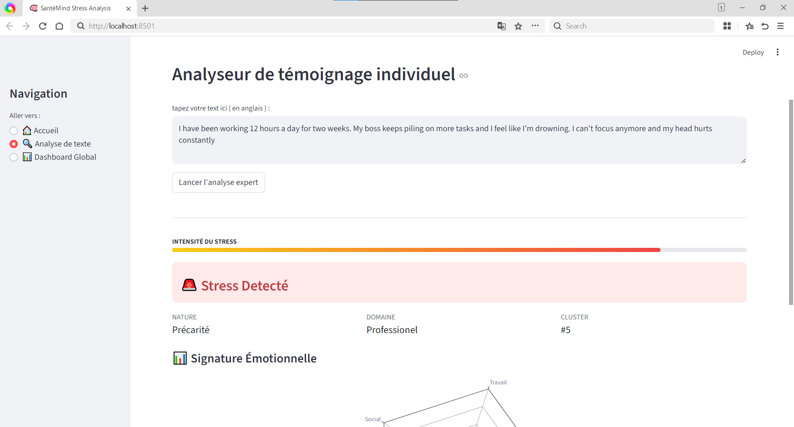
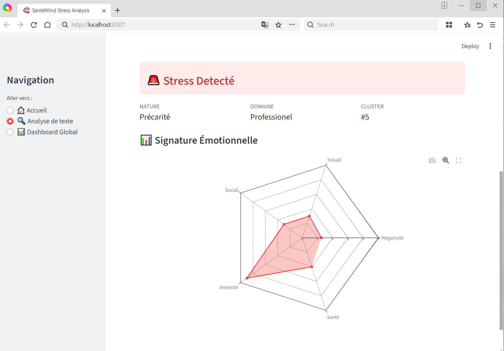
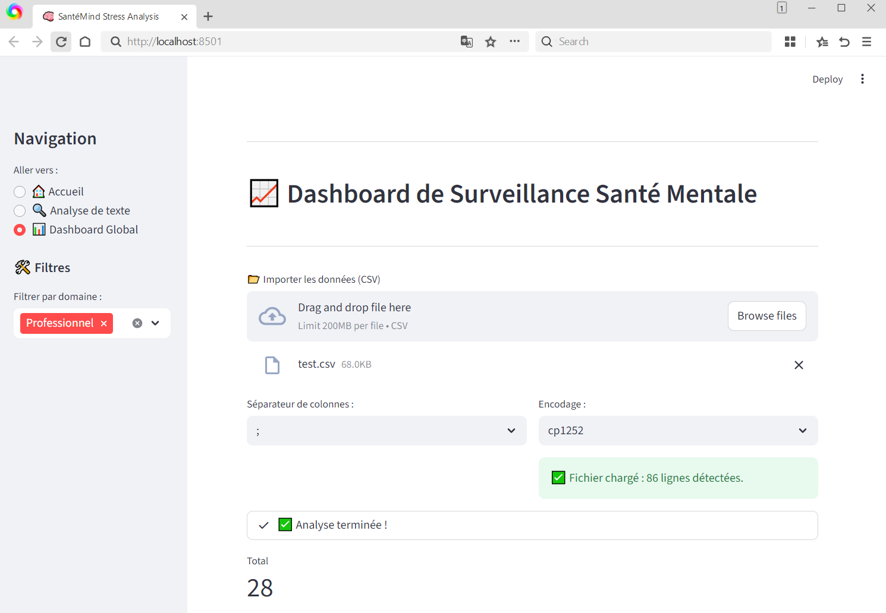

# 🧠 SantéMind : Analyse Intelligente du Stress sur les Réseaux Sociaux


## 📌 Présentation du Projet
SantéMind est une plateforme d'analyse prédictive dédiée à la santé mentale. En utilisant le dataset **Dreaddit**, l'application identifie les signes de détresse psychologique dans les témoignages textuels (Reddit) et propose un profilage précis de la nature du stress.

### 🎯 Objectifs
- **Détecter** la présence de stress via un classifieur SVM.
- **Catégoriser** le type de détresse (Burnout, Panique, Social, etc.) via K-Means.
- **Visualiser** les tendances émotionnelles et temporelles via un Dashboard interactif.

---

## 🛠️ Architecture Technique
L'application repose sur un pipeline de traitement de données (NLP) avancé divisé en deux phases :

### 1. Prétraitement & Vectorisation
**Phase 1 : Nettoyage & Normalisation**
- Suppression des hashtags, URLs et caractères spéciaux.
- **Tokenisation :** Découpage des phrases en mots individuels.
- **Stop Words :** Filtrage des mots vides (the, is, at...).
- **Lemmatisation :** Ramener les mots à leur racine (ex: "running" -> "run").

**Phase 2 : Extraction de caractéristiques**
- **TF-IDF (Term Frequency-Inverse Document Frequency) :** Calcul de l'importance statistique de chaque mot.
- **Analyse de Polarité :** Utilisation de TextBlob pour évaluer le sentiment global.

### 2. Modélisation IA
- **SVM (Support Vector Machine) :** Utilisé pour la classification binaire (Stress vs Stable).
- **K-Means :** Utilisé pour le clustering thématique afin d'identifier la nature du stress.

---

## 📊 Aperçu de l'Interface

### 🔍 Analyse de Texte Individuelle
Permet de tester un témoignage en temps réel. Le système génère un diagnostic immédiat avec une **Signature Émotionnelle** sous forme de graphique radar.

| Analyse Stressé | Analyse Stable |
|:---:|:---:|
|  |  |

### 📈 Dashboard Global (Business Intelligence)
Outil d'analyse massive pour fichiers CSV. Il permet de piloter la santé mentale à grande échelle :
- **KPI dynamiques :** Taux de stress global, Index de burnout moyen.
- **Analyse Temporelle :** Visualisation des pics de stress sur une période donnée.
- **Répartition par Domaine :** Distinction automatique entre stress Professionnel et Personnel.

<p align="center">
  
</p>

---

## 🚀 Installation et Lancement
**Installation des dépendances**
pip install -r requirements.txt

**Lancement de l'application**
streamlit run app.py

## 📂 Structure du Répertoire
app.py : Interface utilisateur Streamlit et logique de navigation.

MoteurDeTraitement.py : Pipeline complet de prétraitement et extraction des features.

santemind_model.pkl : Modèles IA (SVM & K-Means) entraînés et sérialisés.

requirements.txt : Liste des bibliothèques nécessaires (Pandas, Scikit-learn, Plotly...).

demo/ : Captures d'écran pour la documentation.

### 1. Clonage du projet
```bash
git clone [https://github.com/votre-nom/SanteMind.git](https://github.com/votre-nom/SanteMind.git)
cd SanteMind